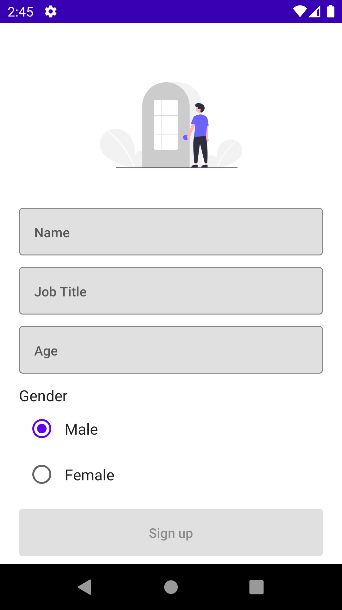
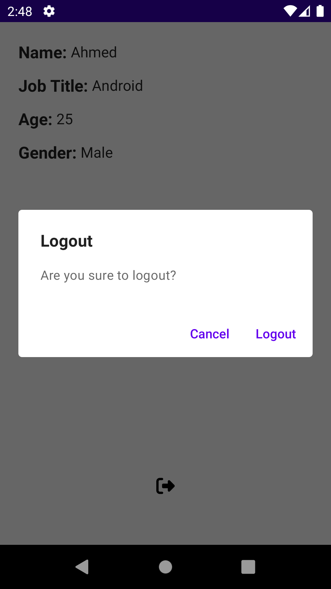

# Madarsoft-Task
Simple app with 2 screens with clean arch and last tech in android     
(First screen: purpose of it  : Takes user's name, age, job title and gender then saves those data on local db
Second screen: purpose of it : Show saved data)

## ScreenShots:

  
  

## Demo

  

## APK Download
[Click here](https://drive.google.com/file/d/1YPcC-6TEe3AH9yt7vMmkDIqkJbE7djKU/view?usp=sharing)

## In-App architecture

  

## Features
- Obfuscation
- Simple UI
- Config changes handling

## Tools & APIs
- Compose
- Kotlin
- Clean architecture
- Jetpack Compose
- Compose navigation
- MVVM + MVI arch pattern
- Coroutines
- Proguard
